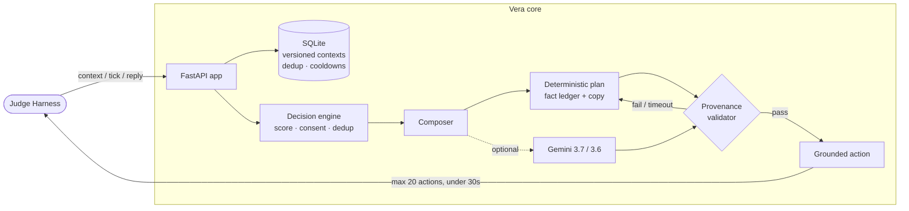
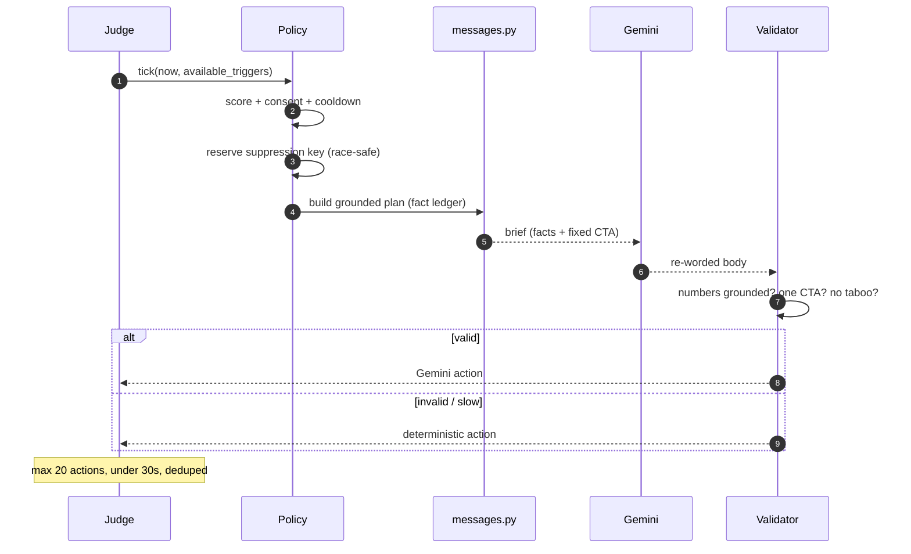
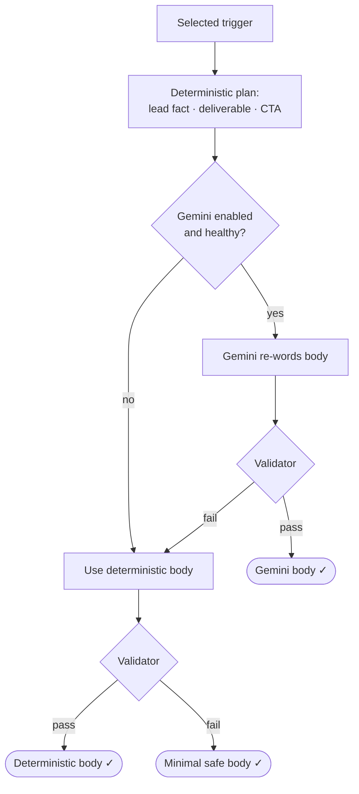
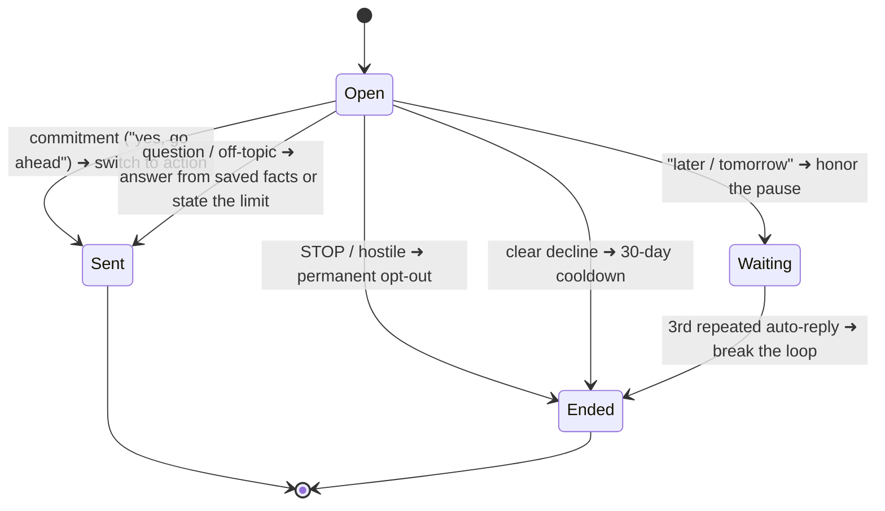

<div align="center">

# 🤖 Vera — Grounded Message Engine

### magicpin AI Challenge · Team **RisingStar**

*A deterministic decision core that never hallucinates, with a Gemini composer that only ever re-words facts it's allowed to use.*

`POST /v1/context` · `POST /v1/tick` · `POST /v1/reply` · `GET /v1/healthz` · `GET /v1/metadata`

**Python 3.11 · FastAPI · SQLite · PydanticAI → Gemini 3.7 / 3.6 Flash**

</div>

---

## The one idea

> **Code decides. The model only writes.**

Deterministic policy owns every consequential choice — **whether** to send, **who** receives it, **which** facts are quotable, and **what** CTA is valid. An optional Gemini composer may polish the wording, but its output must clear the **same provenance validator** as the built-in copy. Anything invalid, slow, or unavailable falls back automatically to grounded text.

The result: **every number, name, offer, and source in an outgoing message provably came from the context we were given.** Hallucination — the challenge's #1 disqualifier — is structurally impossible.

---

## Architecture



Three modules, each small and focused:

| File | Responsibility |
|---|---|
| [`app/policy.py`](app/policy.py) | **Decide.** Score triggers, enforce consent & cooldowns, dedup by suppression key, cap at 20/tick |
| [`app/messages.py`](app/messages.py) | **Write.** Turn the chosen signal into grounded copy — the single sharpest fact, a named deliverable, one CTA |
| [`app/composer.py`](app/composer.py) | **Guard.** Orchestrate the Gemini overlay and run the number / URL / taboo / CTA validator on every draft |

---

## What happens on a `/v1/tick`



Independent recipients are composed **in parallel** with per-call timeouts, so one slow model call can never blow the 30-second budget.

---

## The compose ladder (why output is always safe)



Every rung ends in grounded, validated text. There is no path to an ungrounded send.

---

## How it targets the five scoring dimensions

| Dimension | How Vera earns it |
|---|---|
| 🎯 **Decision quality** | Policy picks the single highest-value signal (explicit intent › time-pressure › specificity), not every fact |
| 🔬 **Specificity** | Copy leads with real numbers, offers, dates, batch IDs — and **derived counts** ("your 124 high-risk adult patients", "your 245 members") |
| 🗣️ **Category fit** | Per-category voice + a taboo list the validator enforces (no "guaranteed", "miracle", …) |
| 🏪 **Merchant fit** | Owner first name, live offer catalog, customer-aggregate subsets, prior conversation state |
| 🧲 **Engagement** | One sharp hook, a named deliverable, an effort cap ("2-min read", "Live in 10 min"), one low-friction ask |

**Grounding proof:** the composer builds a *fact ledger* from the context, and the validator rejects any number in the body that isn't traceable to it (dates, ISO components, and small "N min/sec" effort caps are whitelisted; factual durations are not).

---

## Replies — a small, strict state machine

`/v1/reply` returns `send` / `wait` / `end` within 30s, tuned for the evaluator's hardest turns:



Handles commitment vs. question ("yes, what next?" is action intent), canned auto-reply loops, consent/STOP, defer, decline, off-topic, and ambiguity — verified live.

---

## Endpoints

| Method | Path | Behaviour |
|---|---|---|
| `POST` | `/v1/context` | Atomic, monotonic-versioned storage. Identical re-push = idempotent `200`; different payload at same version = `409`. 500 KB cap. |
| `POST` | `/v1/tick` | Prioritize → dedup → compose. ≤ 20 actions, race-safe. |
| `POST` | `/v1/reply` | `send` / `wait` / `end` from the reply state machine. |
| `GET` | `/v1/healthz` | Model-independent liveness + context counts. |
| `GET` | `/v1/metadata` | Team & implementation identity. |

---

## Run it

```bash
python -m venv .venv
.venv/Scripts/python.exe -m pip install -e ".[dev]"     # Windows
# .venv/bin/python -m pip install -e ".[dev]"           # macOS / Linux
.venv/Scripts/python.exe -m uvicorn app.main:app --host 127.0.0.1 --port 8080
```

**Test & self-check** (from another terminal):

```bash
.venv/Scripts/python.exe -m pytest -q                                   # 21 tests
.venv/Scripts/python.exe scripts/live_e2e.py https://YOUR-PUBLIC-URL    # full live proof, incl. Gemini
.venv/Scripts/python.exe scripts/run_official_simulator.py --scenario all
```

`live_e2e.py` uses isolated probe IDs, so it never consumes an official challenge trigger, and it asserts (via the `X-Vera-Composer` header) that a validated message was actually composed by Gemini — not the fallback.

---

## Gemini

Enabled by default; the deterministic composer is the automatic outage/validation fallback. Copy `.env.example` → `.env` and set a Google AI Studio key:

```dotenv
VERA_MODEL_ENABLED=true
VERA_MODELS=google:gemini-3.7-flash,google:gemini-3.6-flash
GOOGLE_API_KEY=your-secret-key
```

Provider-qualified model IDs are tried in order. The LLM **never** chooses triggers or CTAs and **cannot** bypass the fact/number, URL, taboo, or repetition checks — it may only re-word an already-approved, grounded body.

### Configuration

| Variable | Default | Purpose |
|---|---|---|
| `VERA_MODEL_ENABLED` | `true` | Enable the validated Gemini overlay |
| `VERA_MODELS` | `gemini-3.7-flash, gemini-3.6-flash` | Ordered, comma-separated model IDs |
| `VERA_MODEL_TIMEOUT_SECONDS` | `18` | Hard composition timeout (clamped 15–22) |
| `VERA_EVALUATION_NO_URLS` | `true` | Reject URLs in generated copy |
| `VERA_MAX_ACTIONS_PER_TICK` | `20` | Output cap, always clamped to 20 |
| `VERA_DATABASE_PATH` | `data/vera.db` | SQLite path |
| `VERA_TEAM_NAME` / `VERA_TEAM_MEMBERS` / `VERA_CONTACT_EMAIL` | RisingStar · Krrish Rastogi | Submission metadata |

---

## Deploy (Railway)

1. Push to GitHub; create a Railway project from the repo — the root `Dockerfile` + `railway.json` are auto-detected.
2. Set service variables: `GOOGLE_API_KEY`, `VERA_MODEL_ENABLED=true`, `VERA_MODELS=google:gemini-3.7-flash,google:gemini-3.6-flash`.
3. Generate a public domain; keep **one** replica live throughout evaluation.

**State model:** contexts, dedup, conversations and cooldowns live in SQLite. Per-session state (consumed suppression keys, cooldowns, conversations) is **reset on every boot**, so each evaluation starts clean — the harness re-pushes base contexts at warmup, and identical re-pushes are idempotent. A fresh redeploy immediately before submitting guarantees a pristine start.

---

## Design decisions & tradeoffs

- **Deterministic-first, model-second.** The decision layer is fully testable and reproducible; the model is a bounded, validated polish step — not a source of truth. Turning the model off still yields a complete, grounded submission.
- **Gemini stays on — measured, not assumed.** A/B against the LLM judge on the anchor triggers: **deterministic 38.8/50 vs Gemini 39.5/50**. Gemini wins once the brief forces it to preserve every supplied number, so it's kept for the extra fluency and CTA variety.
- **One Uvicorn worker.** SQLite handles the judge's 10 req/s comfortably; a single process keeps the DB and model setup simple and correct.
- **Provenance over cleverness.** The validator would rather fall back to plain grounded copy than ship a sharper line with one unverifiable number.

---

## Repo layout

```
app/
  main.py        FastAPI wiring + endpoints
  policy.py      decision engine (score · consent · dedup)
  messages.py    deterministic copy engine (grounded, per trigger kind)
  composer.py    Gemini orchestration + provenance validator
  reply.py       send/wait/end reply state machine
  storage.py     SQLite: contexts, suppression, conversations, cooldowns
  models.py      request/response + internal schemas
scripts/         preflight · live_e2e · load test · judge runners
tests/           21 tests incl. all 100 expanded triggers
```

<div align="center"><sub>Built for the magicpin AI Challenge · grounded, deterministic, and hard to break.</sub></div>
